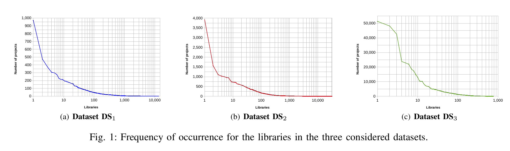

# Introduction

This repository contains the replication package for the following paper that has been accepted to the Technical Track of the 20th Mining Software Repositories Conference (MSR 2023):

<b>Dealing with Popularity Bias in Recommender Systems for Third-party Libraries: How far Are We?</b>

Phuong T. Nguyen, Riccardo Rubei, Juri Di Rocco, Claudio Di Sipio, Davide Di Ruscio<sup>(1)</sup>, Massimiliano Di Penta<sup>(2)</sup>

<sup>(1)</sup> Università degli Studi dell'Aquila, Italy

<sup>(2)</sup> Università degli Studi del Sannio Benevento, Italy

A preprint of the paper is available in the following ([link](https://arxiv.org/pdf/2304.10409.pdf))

## Popularity bias in Recommender Systems for Software Engineering

Recommender systems for software engineering (RSSEs) assist software engineers in dealing with a growing information overload when discerning alternative development solutions. 

While RSSEs are becoming more and more effective in suggesting handy recommendations, they tend to suffer from popularity bias, i.e., they favor items that are relevant mainly because several developers are using them. While this rewards artifacts that  are likely more reliable and well-documented, it would also mean missing artifacts rarely used because they are very specific or more recent. 

This work studies popularity bias in Third-Party Library (TPL) RSSEs. First, we investigate whether state-of-the-art research in RSSEs has already tackled the issue of popularity bias. Then, we quantitatively assess 4 existing TPL RSSEs, exploring their capability to deal with the recommendation of popular items. Finally, we propose a mechanism to defuse popularity bias in the recommendation list. The empirical study reveals that the issue of dealing with popularity in TPL RSSEs has not received adequate attention from the software engineering community. Among the surveyed work, only one starts investigating the issue, albeit getting a low prediction performance.

## Venues
We conducted a literature analysis on premier venues in Software Engineering, which are listed in following Table:


# Systems and datasets

We briefly introduce the systems considered in the evaluation, namely LibRec, CrossRec, LibSeek, and GRec. Afterwards, we present the dataset exploited for the
experiments. The software and hardware configurations for the testing platform are finally specified.

## Considered recommender systems

| System                                    | Working mechanism                                                                                                                                                                                                                                                                       | Potential risks                                                                                                                                                                                                                        |
|----------------------------------------------------|--------------------------------------------------------------------------------------------------------------------------------------------------------------------------------------------------------------------------------------------------------------------------------------------------|-------------------------------------------------------------------------------------------------------------------------------------------------------------------------------------------------------------------------------------------------|
| LibRec                       | LibRec is built on top of a light collaborative-filtering technique and association mining, looking for libraries that are used by popular projects. | The system is exposed to popularity bias by its nature, retrieving only popular libraries thanks to association mining.                                     |
| CrossRec          | CrossRec employs a collaborative-filtering technique to mine TPLs from similar projects.| The system is prone to popularity bias as it recommends libraries coming from projects that are similar. |
| LibSeek  | LibSeek uses matrix factorization, attempting to neutralize the bias caused by the popularity of TPLs by means of an adaptive weighting mechanism.| Due to its internal design, the system is expected to mitigate the effect of popularity bias. 
| GRec  | Built on top of graph neural networks, GRec learns to recommend TPLs through app-library interactions.| Thanks to the underlying link prediction technique, GRec is supposed to recommend popular libraries. 


## Datasets 
We use datasets curated by
existing studies to evaluate the four TPL RSSEs. Overall, we
consider three datasets from Java open source software, two
(DS1 and DS2) related to generic software systems, and one
(DS3) specific to Android apps. In particular, DS1 was curated
to evaluate CrossRec, while DS3 (originally named MALib7)
has been involved in the experiments of both LibSeek and
GRec. Finally, we introduced DS2 as an extension of DS1
to study how the approaches perform by considering a larger
number of libraries. The datasets are summarized in the next table.



To give a first idea of how the dataset could cause popularity
bias, we counted the number of occurrences for each library
in a dataset, and sorted all the libraries in descending order of
this number. The frequency for the libraries of DS1, DS2, and
DS3 is shown in Fig. 1. As it can be seen, there is always a
long tail in all three datasets. For instance, in DS1 the most
popular library is junit:junit, being included in 969 over 1; 200
projects. Meanwhile, the majority of the TPLs are infrequent
i.e., we count 10; 212 among 13; 497 libraries appearing only
once in the whole dataset.
The lower part of Table III enumerates the experimental
configurations we considered, where the columns represent
datasets, and the rows correspond to systems. A cell is filled
with a tick (4) if the tool in the corresponding row is executed
on the dataset in the column, otherwise, it is filled with (7).
Only DS2 is used for experiments with all the four tools. In
this respect, the dataset is used to compare the performance
of the RSSEs.


## How to cite
If you find our work useful for your research, please cite the papers using the following BibTex entries:

```
@inproceedings{Nguyen:2023:BiasInRSSE,
 author = {Nguyen, Phuong T. and Rubei, Riccardo and Di Rocco, Juri and Di Sipio, Claudio and Di Ruscio, Davide and Di Penta, Massimiliano},
 title = {{Dealing with Popularity Bias in Recommender Systems for Third-party Libraries: How far Are We?}},
 booktitle = {Proceedings of the 20th Mining Software Repositories Conference},
 series = {MSR '23},
 year = {2023},
 location = {Melbourne, Australia},
 publisher = {IEEE Press},
 address = {Piscataway, NJ, USA},
} 

```
